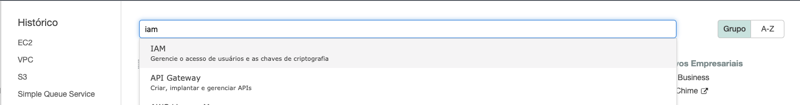
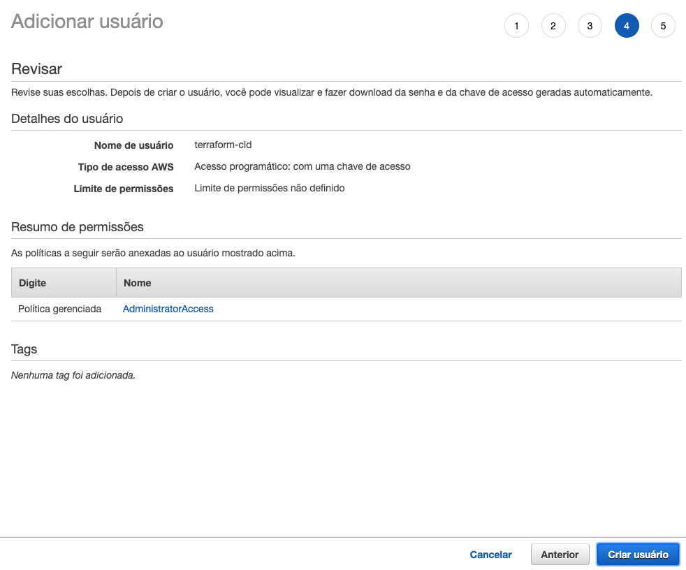
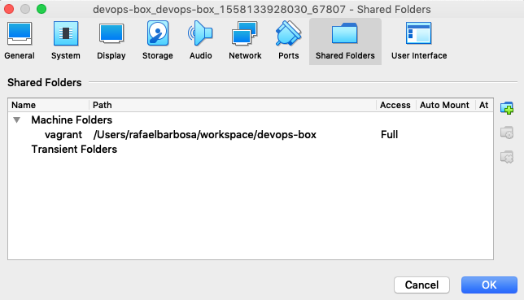
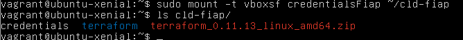

1. Faça o Login no painel da AWS
2. Escolha IAM no menu e vá para a página do serviço
   
3. Clique em usuários no menu lateral direito
4. Clique em 'Adicionar usuário'
5. De o nome de 'terraform-cld' ao seu usuario e selecione apenas 'Acesso programático'. Após isso clique em próximo
   
6. Selecione 'Anexar políticas existentes de forma direta' no menu superior e dentre as opções que aparecem selecione 'AdministratorAccess' e vá para a próxima pagina
   
7. Vá até a ultima pagina e clique em criar usuário.
   
8. Na tela que vem na sequencia da criação clique em 'Fazer download .csv'. Esse é o único momento que você terá acesso a esse arquivo. Guarde-o bem.
   
9. O arquivo credentials que você baixou contem campos separados por virgula. Os que mais te interessam no momento são os campos Access key ID e Secret access key, terceiro e quarto campos do arquivo.
10. Você precisa criar um arquivo chamado `credentials` com o seguinte layout 
    
```yaml
[default]
aws_access_key_id = SUA Access key ID
aws_secret_access_key = SUA Secret access key
```

11. salve em um lugar de facil acesso.
12. Abra o virtual box
13.   Clique com o botão direito em cima da imagem Devopsbox rodando e seleciona 'setiings'
   
14.  Clique em 'shared folders'no menu superior
   
15. Clique no sinal de adicionar pasta na lateral direita central da tela.
16. Em 'Folder Path' escolha a pasta onde você colocou o arquivo recem criado.
17. Em 'Folder Name' coloque o nome 'credentialsFiap' e clique em `ok`
18. Clique 2 vezes na VM rodando para acessar a maquina. O usuário e senha são `vagrant`
19. Execute os comandos abaixo para resolver as dependencias para ler as pastas do host 
```shell
    sudo apt-get update -y
    sudo apt-get install build-essentiallinux-headers-`uname -r` -y
```
20. Reinicie a VM com o comando `sudo shutdown -r now`
21. Faça o login novamente após o boot
22. Cria a pasta onde será realizado o pareamento `mkdir cld-fiap`
23. sudo mount -t vboxsf credentialsFiap ~/clf-fiap
24. Se der um comando `ls cld-fiap` verá que consegue ver os arquivos do seu host
    
25. Rode o comando `mkdir ~/.aws` para criar o local onde deve ficar o credentials
26. Execute o comando `cp cld-fiap/credentials ~/.aws`
27. Execute o `aws configure`. Pule as 2 primeiras etapas que pode notar já estarem preenchidas. Em 'Default region name' coloque o valor `us-east-1` e em 'Default output format' coloque `json`

